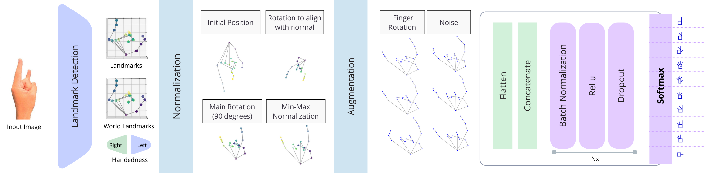

# SignWriting for Gesture Recognition in Sign Language

## Overview

Gesture recognition plays a vital role in fostering inclusive communication, especially within Deaf communities. However, it faces significant challenges due to the diversity of sign languages. Conventional approaches, primarily based on Convolutional Neural Networks (CNNs), have shown promising results but are often confined to specific languages, requiring extensive datasets. This limits scalability and broader applicability. 

To address these limitations, we propose leveraging **SignWriting (SW)**, a standardized visual notation system that encodes gestures independently of language, offering a universal solution for gesture recognition. Our method employs Mediapipe to capture hand landmarks, applies normalization and data augmentation techniques to manage variability, and uses a robust deep learning architecture to classify gestures. The system has been validated on 16 diverse datasets, encompassing 132 unique gesture classes from various regions and sign languages, demonstrating high accuracy, robust generalization, and suitability for real-time applications.

---

## Objectives

- Utilize **SignWriting** as a universal representation for gesture recognition.
- Develop a deep learning pipeline for gesture classification that is language-independent.
- Evaluate the system's performance on diverse datasets, addressing scalability and variability challenges.
- Provide tools for efficient benchmarking and testing of the model under different computational constraints.

---

## Methodology

The adopted methodology is illustrated in the figure below. It follows these steps:
1. **Landmark Detection**: Mediapipe extracts 21 points from finger joints and tips.
2. **Normalization**: Standardizes the landmarks for consistency.
3. **Data Augmentation**: Generates variations using "Finger Rotation" and "Noise".
4. **Preprocessing**: Converts landmarks into concatenated vectors.
5. **Model Training**: The fully connected network uses Batch Normalization, ReLU activations, Dropout layers, and a final Softmax classifier for gesture recognition.
6. **Mapping**: Maps recognized gestures to **SignWriting** symbols.



---

## Prerequisites

- Prepare the datasets in the following structure under `assets/raw_data`:
  ```
  assets/raw_data/<dataset_name>/images/<classes>
  ```
  Each class should have a folder containing the respective images.
  
- **Download and Map Datasets**:
  Example: Download and map the OUHANDS dataset:
  ```python
  from ouhands import OUHANDS
  OUHANDS(base_path="../assets/raw_data/").download().map_classes()
  ```
  - This will create:
    - `original/`: Raw dataset download.
    - `images/`: Images organized by class and mapped to SW.

---

## Running the Project

### Configuration File

Create a `config.yaml` file and adjust the parameters according to your experiment. Example:

```yaml
base_data_path: "assets/raw_data"
experiment_path: "assets/experiment_data"
landmark_detector: "mediapipe"
# skip_steps: ["package", "train", "summary"]

package:
- dataset: "signwriting_org_v2"
  use: "train"
  preprocess:
    landmarks: ["normalization"]
  augmentation:
    methods: ["rotate_finger", "perturb_points"]
    factor: 20

- dataset: "bengali_alphabet_train"
  use: "train"
  sample: 25
  preprocess:
    landmarks: ["normalization"]
  augmentation:
    methods: ["rotate_finger", "perturb_points"]
    factor: 20

- dataset: "bengali_alphabet_val"
  use: "val"
  preprocess:
    landmarks: ["normalization"]

- dataset: "bengali_alphabet_test"
  use: "test"
  preprocess:
    landmarks: ["normalization"]

training:
- model: "fully_connected"
  framework: "tensorflow"
  batch_size: 32
  learning_rate: 0.001
  lr_decay: 0.99
  epochs: 100
  fc_layers: 4
  fc_units: 512
  dropout: 0.4

evaluation:
  methods: ["simple", "bootstrap", "anomaly", "error"]
```

### Running the Pipeline

Run the pipeline using the command below:

```bash
python modeling/pipeline.py config.yaml
```

---

## Benchmarking

To benchmark the model under different computational constraints (using Docker):

1. Ensure Docker is installed.
2. Navigate to the benchmark folder:
   ```bash
   cd benchmark/
   ```
3. Run the benchmark script (currently available for Windows):
   ```bash
   run_tests.bat
   ```

This script will test the model with varying CPU and memory configurations, providing performance metrics such as inference time and throughput.

---

## Running Multiple Experiments

Scripts for running experiments sequentially or in parallel are available in the `scripts/run` folder:

- **Parallel execution**: Suitable for leveraging multiple CPUs.
- **Sequential execution**: For simpler setups.

Navigate to the folder and run the desired script for your use case.

---

## Notes

- The system currently supports only **Windows** for benchmarking scripts.
- Results, including confusion matrices and analysis of Mediapipe errors, can be accessed in the output folder specified in the `experiment_path`.
